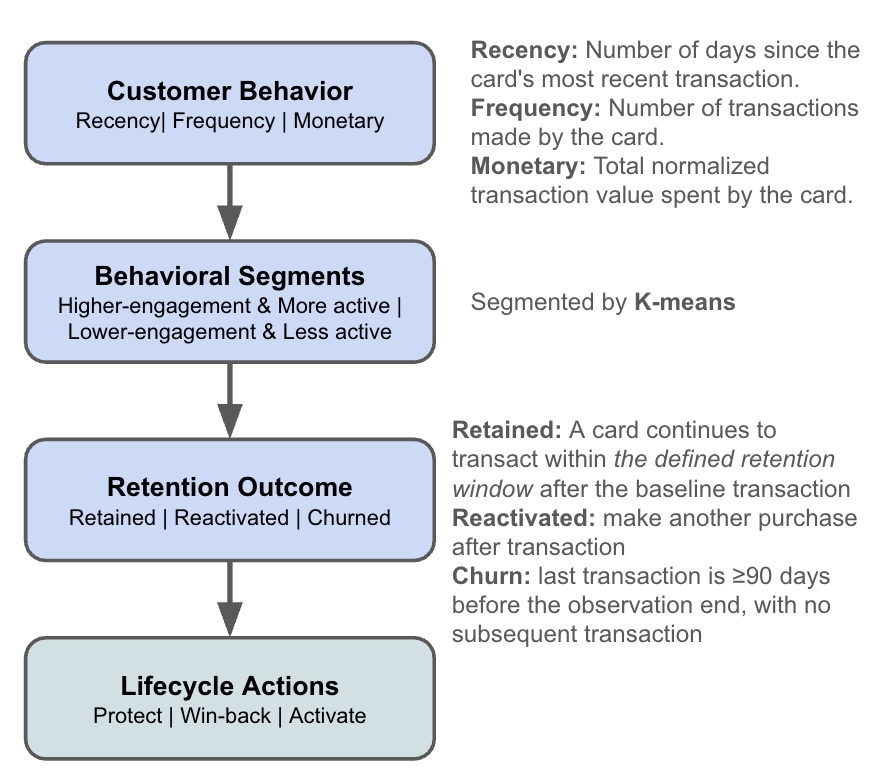
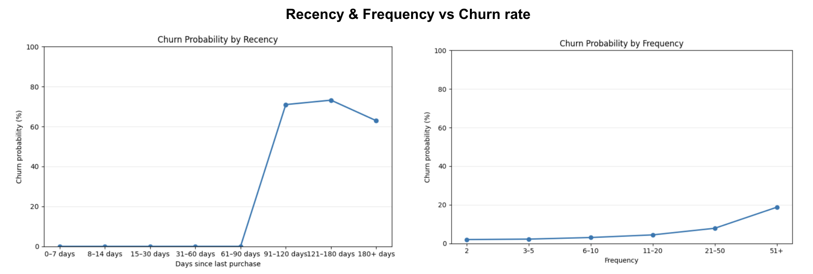
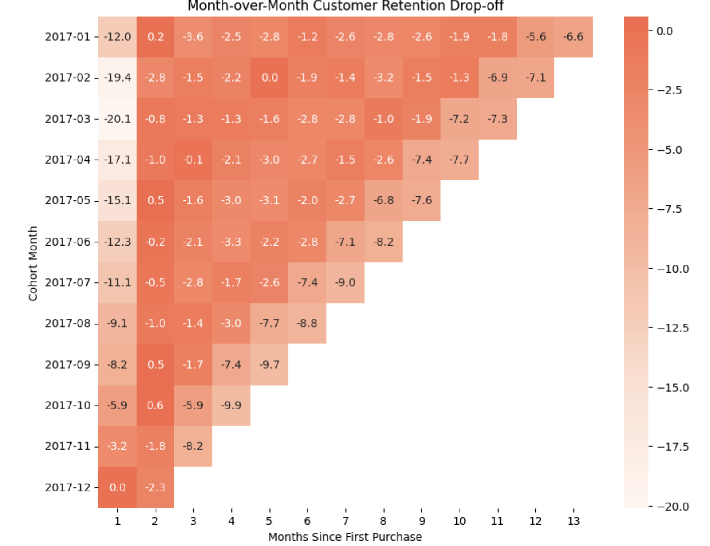
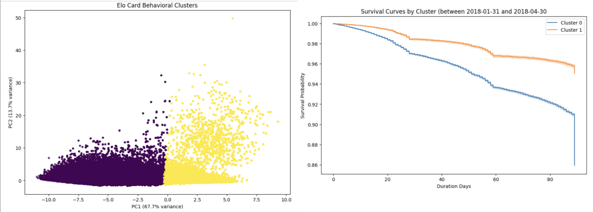

# Fintech Product Analysis: Customer Retention & Behavioral Segmentation Analytics

## Executive Summary

**How can transaction behavior be used to identify customer lifecycle risk, understand retention, and inform targeted engagement strategies?**

This project analyzes transaction-level data from **Elo**, a Brazilian payment network, to understand how cardholder behavior relates to **engagement, reactivation, churn, customer value, and retention**.

Rather than treating customer value as simply a spending problem, the analysis investigates whether **behavioral habits — recency, frequency, merchant/category breadth, and transaction patterns — provide earlier and more actionable signals of customer retention risk.**

## Key Findings

| # | Hypothesis / Analysis | Result | Business Implication |
|---|---|---|---|
| H1 | Recency & frequency vs. monetary value as churn predictors | Recency is strongly associated with churn (Pearson 0.84); frequency shows a weak/negative association (Pearson -0.11). Note: churn is defined by 90-day inactivity, so recency's correlation is partly definitional — the actionable signal is *how early* declining recency predicts eventual churn, not the correlation itself. | Lifecycle risk models should treat recency as the primary early-warning signal, not spend level. |
| H2 | Longer inactivity → lower reactivation odds | Cards inactive 30+ days reactivate significantly slower than 5–10 day cases (log-rank p < 0.005); median time-to-reactivation rises from ~6–10 days to 16+ days. 98th percentile of reactivation gaps is ~28 days. | A ~30-day inactivity threshold is a defensible trigger point for win-back campaigns rather than waiting for organic reactivation. |
| H3 | Newer cohorts show steeper early drop-off | Feb/Mar cohorts lost 17–20% of users in month 1 vs. under 3% in month 2 — the decline is front-loaded. | Onboarding/early-activation investment likely has more leverage than later-stage win-back spend, though win-back still matters at scale. |
| RFM-1 | Value concentration (Monetary tier analysis) | The top 36.19% of users (Top + High tier) account for 59.62% of total monetary value; the remaining 44.05% (Mid-high + Mid) account for just 39.07%. | Customer value is concentrated in a relatively small group — protecting this segment's retention matters disproportionately, but "high-value" and "healthy/low-risk" aren't the same thing and must be assessed separately. |
| RFM-2 | Frequency as a driver of LTV | Frequency correlates strongly with monetary value on its own (Spearman ρ = 0.930), but once AOV is controlled for, frequency adds almost no independent effect (OLS std coef = 0.007) — the relationship is mediated through AOV, not direct. | LTV growth strategies aimed purely at transaction frequency may be mediated by order size, not habit — AOV-focused and frequency-focused interventions need to be evaluated separately, not treated as interchangeable levers. |
| H4 | Behavioral segments have distinct retention, not just spend | K-Means found two clusters; the high-engagement cluster shows measurably higher survival/retention than the low-engagement cluster across the observation window. | Segments should get differentiated lifecycle treatment (protect vs. activate), not a single blanket retention strategy. |
| H5 | Merchant/category diversity as an independent loyalty signal | Retention rises sharply with diversity (churn 27.6%→11.7% by merchant tier, 27.9%→10.8% by category tier), but frequency also rises ~8x across the same tiers — so the naive diversity effect is confounded and not yet proven independent of frequency. | Diversity is a promising engagement signal worth tracking, but campaigns shouldn't target "breadth" alone until the frequency-controlled model confirms an independent effect. |

### Illustrative Revenue Impact

At-risk revenue by tier (churn rate × avg spend × tier size):

| Tier | At-Risk Revenue | Avg Spend | Churn Rate | Protected Revenue (2pt churn reduction) |
|---|---:|---:|---:|---:|
| Mid | $1,544,893 | $121.12 | 23.0% | $30,898 |
| Top + High | $697,926 | — | — | $13,959 |
| Mid-high | $652,864 | — | — | $13,057 |

**Total protected revenue from a 2-point churn reduction across all tiers: ~$57,914**

**Key insight:** Despite Top+High tier having the highest per-customer value (per the RFM concentration finding — 36% of users driving 60% of value), the **Mid tier carries the largest absolute revenue at risk** ($1.5M vs. ~$650–700K), because its much larger customer base and 23% churn rate outweigh its lower per-customer spend. A uniform churn-reduction intervention would protect more than 2x the revenue if targeted at Mid-tier vs. Top+High tier alone.

**Caveat:** These are illustrative estimates based on observed churn rates and a hypothetical 2-point reduction, not a validated causal effect — see Proposed Experiment section for how this would be tested before informing budget decisions.
## From Analysis to Lifecycle Strategy

The ultimate goal is not simply to produce statistically significant findings — the analysis is designed to translate behavioral signals into actionable lifecycle treatment.

| Behavioral State | Potential Lifecycle Objective | Priority Basis |
|---|---|---|
| Mid-tier value + high churn (23%) | **Highest-priority churn reduction** — largest absolute revenue at risk ($1.5M) due to tier size, despite lower per-customer spend | Volume × churn rate |
| Top + High-value + declining recency | Protect & prevent revenue loss — highest per-customer value, though smaller absolute at-risk pool than Mid-tier | Per-customer value |
| Recently activated + low frequency | Build habit / activation | Early lifecycle (H3) |
| Long inactivity (30+ days) | Win-back intervention | Reactivation odds (H2) |
| Low engagement / low diversity | Re-engagement or lower-cost treatment | H4/H5 segment risk |
| High merchant/category diversity | Protect broad card usage | Loyalty signal (H5) |

**Note:** Per-customer value and absolute revenue-at-risk don't point to the same tier. Top+High customers are individually more valuable, but the Mid-tier's larger population and elevated churn rate (23%) mean it carries the greatest total revenue exposure ($1.5M vs. ~$650–700K for the other tiers). A resource-constrained lifecycle team optimizing for total dollars protected — rather than per-customer value alone — should weight Mid-tier retention efforts accordingly, alongside continued protection of the high-value base.


### Analytical Approach

The project combines:

- Customer-level RFM analysis
- Retention & churn analysis
- Time-to-reactivation / survival analysis
- Behavioral segmentation & clustering
- Cohort retention analysis
- Statistical hypothesis testing
- Lifecycle and win-back strategy recommendations

> **Core business question:**
> *Can we identify distinct customer behaviors and detect declining engagement early enough to enable differentiated lifecycle intervention?*

---

## Business Context

Elo operates a payment network and partners with merchants to provide cardholders with relevant offers and promotions.

The underlying business challenge is not simply predicting how much a customer will spend. A useful customer analytics system should help answer:

1. Who is engaged and who is becoming inactive?
2. How long can a customer remain inactive before reactivation becomes unlikely?
3. Which behavioral segments have fundamentally different retention patterns?
4. Are high-value customers always loyal, or can valuable customers also become at risk?
5. Can customer behavior be translated into actionable lifecycle segments?

This project approaches the problem from a **product analytics and lifecycle management perspective**, moving from:

**Behavioral measurement → Diagnosis → Segmentation → Retention outcomes → Potential intervention**

---

## Analytical Framework


---

# Key Hypotheses
## 1. Retention & engagement diagnosis
### H1 — Engagement (Recency & Frequency) vs. Customer Value --> Churn

> **Purchase recency and frequency are stronger predictors of future churn than transaction value, suggesting that habitual engagement may be more important for retention than simply spending more.** (**Business question:** Should lifecycle teams prioritize behavioral engagement signals over monetary value when identifying customers at risk?)

**Finding:**

- Against Recency, churn probability increases materially between 90-120 days and 121-180 days while higher frequency shows modest impact on churn probability with 20% Churn rate on 50+ more frequent buyers.
- Recency shows strong correlation with Churn, having 0.84 Pearson and 0.61 Spearman. On the other hand, Frequency has negative correlation between Churn with -0.11 Pearson and -0.16 Spearman.
- It is important to note that the definition of “Churn” here is “no transaction from 90 days before the cutoff of the data” and this can explain hte strong correlation between recency.



**Why this matters:** A high-spending customer is not necessarily a loyal customer. A customer who purchases frequently may provide a stronger signal of an established behavioral habit.

**Analysis:**
- RFM feature engineering
- Pearson/Spearman correlation analysis
- Churn-rate comparison across engagement tiers
- Logistic regression / predictive modeling
- Feature importance and model interpretation

---

### H2 — D5 vs D10 Retention --> Inactivity & Reactivation 

> **The longer a card stays inactive, the less likely it is to come back.** Cards still inactive at day 10 reactivate slower than cards inactive at day 5 — and day 30 is checked as a further point to see if the effect keeps compounding. (**Business question:** At what point does waiting for organic reactivation become less attractive than initiating a win-back intervention?)

**Finding:**
- Cards inactive for 30+ days show a statistically significant difference in subsequent reactivation compared to cards inactive for only 5–10 days (log-rank p < 0.005).
- The practical difference is large: median time-to-reactivation is 6.08 days for day-5 survivors/9.68 days for day-10 survivors vs. 16.26 days for day-30 survivors

**Methodology:**
- Transaction-gap analysis
- Distribution of time-to-reactivation
- Right-censoring
- Kaplan-Meier survival analysis
- Reactivation probability at 7/14/21/30/45/60/90 days
- Evaluation of the 30-day candidate threshold

**Initial finding** — among completed reactivation episodes:

| Percentile | Gap |
|---|---:|
| 90th | 7.1 days |
| 95th | 14.6 days |
| 97th | 21.8 days |
| 98th | 27.8 days |
| 99th | 37.8 days |

The 98th percentile is approximately 28 days, making 30 days an interesting candidate threshold for further investigation — not an assumption that 30 days is automatically correct.

---

### H3 — Cohort Retention & Activation Risk (Earlier Cohort --> Retention Decline)

> **Do newer customer cohorts exhibit steeper early retention declines than older cohorts, indicating an onboarding or activation opportunity?** (**Business question:** Are newer customers failing to develop repeat usage at the same rate as established customers?)

**Finding:**
- Earlier cohorts in February and March exhibit steeper earlier drop off with -19.4, -20.1, and -17.1 dropoffs in the first month and -2.8, -0..8, and -1.0 in the subsequent month
- --> the growth/lifecycle team should focus on early activation and habit formation, rather than lying to much on primarily on later-stage win-back campaigns.
- Later win-back campaigns still matters as each cohort still see increase in drop-off especially at the beginning of the year.




---

## RFM & Customer Value Analysis

### Customer-Level Behavioral Features

RFM provides the foundation for customer behavioral analysis.

**Recency** — How recently did the customer transact?
- `Recency = observation_date − last_purchase_date`
- Lower recency indicates more recent engagement.

**Frequency** — How often did the customer transact?
- `Frequency = number of transactions`
- Frequency is used as a proxy for behavioral engagement and habit formation.

**Monetary** — How much did the customer spend?
- `Monetary = total transaction value`

**Additional behavioral measures:**
- Average transaction value / AOV
- Unique merchant count
- Category diversity
- Average transaction gap
- Transactions per active month

---

## [Monetary] Customer Value Concentration Analysis 

**Result:** Initial RFM analysis shows a meaningful concentration of transaction value among higher-value customers.

**Findings**
- The top 36.19% of users (Top + High tier) account for 59.62% of total monetary value.
- The remaining 44.05% of users (Mid-high + Mid tier) account for 39.07% of total monetary value.
- This suggests that customer value is concentrated among a relatively smaller group of users, making retention of high-value customers particularly important.

The analysis therefore goes beyond identifying high-value customers and asks: **Which high-value customers are currently healthy, and which are showing behavioral signs of future risk?**

---

## [Frequency] Frequency --> LTV

**Result:** Purchase frequency is a stronger predictor of total customer value (LTV), while it doesn't have any impact after controlling average order value (AOV).

**Findings**
- Spearman ρ = 0.930 → strong monotonic correlation (marginal, ignores other vars)
- OLS std coef = 0.007 → almost no unique effect **once AOV is controlled**
- Why Spearman still matters:
- Monetary is heavily skewed (skew=64, kurtosis=5108) → OLS assumptions (normal residuals, linear fit) are badly violated
- Skewed data → Pearson/OLS coefficients get distorted by outliers; Spearman (rank-based) is robust to that Spearman correctly shows frequency is associated with monetary — OLS just shows that association is mediated through AOV, not independent

---

### H4 — Behavioral Segmentation & Retention (Behavioral Segment --> Retention)

> **Distinct behavioral segments exist, based on RFM and engagement characteristics, and these segments exhibit meaningfully different retention curves — not merely different spending levels.** (Business question: Do different behavioral segments have different retention outcomes, and should they be treated with different retention strategies?)

- K-Means clustering identified two different clusters:
    - **Cluster 0:** Lower-engagement / less-active cards
    - **Cluster 1:** Higher-engagement / more-active cards
- Cluster 1 (High-engagement/Active) has higher retention compared to Cluster 0 (Low-engagement/Less-Active) between 2018-01-31 and 2018-04-30


**Methodology:**

1. **Create customer-level behavioral features** — candidate segmentation variables:
   - `recency_days`
   - `frequency`
   - `monetary`
   - `avg_transaction_amount`
   - `unique_merchant_count`
   - `category_diversity`
   - `avg_days_between_transactions`

2. **Transform and standardize** (transaction behavior is highly skewed):
   ```text
   Raw Features → log1p Transformation → StandardScaler → Clustering
   ```

3. **Identify behavioral clusters** — K-Means clustering evaluated across multiple values of `k`, considering silhouette score, cluster size, behavioral separation, and business interpretability.

4. **Profile each segment** by recency, frequency, monetary, merchant diversity, category diversity, and transaction behavior.

5. **Validate segments against retention** — the key test is whether segments have different post-baseline retention curves, using Kaplan-Meier retention curves and 30/60/90-day retention.

---

### H5 — Merchant & Category Diversity as a Loyalty Signal (Category/Merchant Diversity Segments --> Retention)

> **Do customers who transact across multiple merchants/categories demonstrate higher retention than single-merchant customers, even after accounting for transaction frequency?** (**Business question:** Is breadth of engagement itself associated with retention, or is it simply a consequence of being a frequent user?)

**Findings:**
- Both diversity measures show a strong, monotonic naive link to retention — churn roughly halves from Low to High tier (merchants: 27.6%→11.7%; categories: 27.9%→10.8%).
- But avg_frequency also rises 8x across the same tiers, so this association is confounded and can't yet be called an independent "diversity effect" — Step 2/3 (frequency control) will determine that.

**Unique Merchant Count**
| Tier   | n       | Retention | Churn | Avg Merchants | Avg Frequency |
|--------|---------|-----------|-------|----------------|----------------|
| Low    | 109,503 | 72.4%     | 27.6% | 10.5           | 20.9           |
| Medium | 104,970 | 81.5%     | 18.5% | 25.9           | 55.8           |
| High   | 105,186 | 88.4%     | 11.7% | 67.3           | 171.4          |

**Category Diversity**
| Tier   | n       | Retention | Churn | Avg Categories | Avg Frequency |
|--------|---------|-----------|-------|-----------------|----------------|
| Low    | 112,984 | 72.1%     | 27.9% | 8.0             | 23.5           |
| Medium | 102,367 | 81.4%     | 18.6% | 16.7            | 58.6           |
| High   | 104,308 | 89.2%     | 10.8% | 31.8            | 167.9          |
  
**Variables:** `unique_merchant_count`, `category_diversity`, `frequency`, retention/churn outcome

**Methodology:**
1. Compare retention between low- and high-diversity users.
2. Compare diversity across frequency levels.
3. Model retention/churn while controlling for frequency.
4. Evaluate whether diversity remains associated with retention.

---

## Retention & Churn Definition

Because the dataset contains a finite transaction observation window, churn must account for incomplete follow-up.

### Observed Churn

For a fixed 90-day churn definition:

> A card is classified as having observed churn when its last observed transaction occurred at least 90 days before the end of the available transaction observation period.

```text
Last transaction
       │
       ├──────────── 90+ days ────────────► Observation end
       │
       ▼
  Observed churn
```

### Right-Censored Customers

If the last transaction occurred less than 90 days before the observation period ended:

> The card is right-censored because there is insufficient follow-up to determine whether it would eventually reach 90 days of inactivity.

```text
Last transaction
       │
       ├──────── 30 days ────────► Data ends
       │
       ▼
 Right-censored
```

This should **not** be interpreted as either churned or retained.

**Why survival analysis is useful:** For analyses involving time-to-event outcomes, right-censored observations can be incorporated using survival-analysis techniques rather than incorrectly assigning them a binary churn outcome.

---

## Dataset

The project uses transaction and card-level information from the Elo customer loyalty dataset.

| Dataset | Purpose |
|---|---|
| `train.csv` | Card-level information and loyalty target |
| `test.csv` | Card-level information |
| `historical_transactions.csv` | Historical transaction behavior |
| `new_merchant_transactions.csv` | Transactions at merchants not previously visited by the card |
| `merchants.csv` | Merchant-level attributes |
| `Data_Dictionary.xlsx` | Data field definitions |

> **Data note:** The dataset is simulated/fictitious and does not represent real customer data.

### Important Transaction-Data Consideration

`new_merchant_transactions.csv` contains transactions at **new-to-card merchants**, rather than representing a complete transaction history for the period. Therefore, absence of a transaction in this dataset cannot automatically be interpreted as customer inactivity or churn.

For analyses requiring complete transaction continuity — particularly reactivation, retention, and churn — the transaction coverage and observation window are explicitly considered when defining outcomes.

---

## Analytical Methodology

**Descriptive Analytics**
- RFM analysis
- Distribution analysis
- Customer value concentration
- Transaction-gap analysis
- Cohort analysis

**Statistical Analysis**
- Pearson/Spearman correlation
- Group comparisons
- Hypothesis testing
- MANOVA
- Log-rank tests
- Effect sizes

**Survival Analysis**
- Time-to-reactivation
- Kaplan-Meier curves
- Right-censoring
- Retention curves
- Optional Cox proportional hazards models

**Machine Learning**
- K-Means clustering
- Customer segmentation
- Logistic regression
- Model interpretation

---

## From Analysis to Lifecycle Strategy

The ultimate goal is not simply to produce statistically significant findings — the analysis is designed to translate behavioral signals into actionable lifecycle treatment.

| Behavioral State | Potential Lifecycle Objective |
|---|---|
| High-frequency / high-value | Protect & reward loyalty |
| High-value + declining recency | Prevent revenue loss |
| Recently activated + low frequency | Build habit / activation |
| Long inactivity | Win-back intervention |
| Low engagement | Re-engagement or lower-cost treatment |
| High merchant/category diversity | Protect broad card usage |

The exact treatment should be determined by the magnitude and statistical evidence from the analysis.

---

## Key Deliverables

1. **Customer Behavioral Profile** — RFM-based view of who generates value, who is highly engaged, and where customer value is concentrated.
2. **Churn & Reactivation Framework** — a lifecycle framework distinguishing Active → Increasing inactivity → Potential intervention → Long-term inactivity → Observed churn.
3. **Retention Curves** — comparison of retention trajectories across cohorts, behavioral segments, and engagement levels.
4. **Behavioral Segmentation** — customer clusters characterized by engagement, value, recency, frequency, merchant breadth, and category breadth.
5. **Actionable Lifecycle Insights** — activation opportunities, win-back thresholds, high-value customer protection, and segment-specific lifecycle strategies.

---

## Project Structure

```text
elo-customer-retention/
│
├── data/
│   └── README.md
│
├── notebooks/
│   ├── 01_data_preparation.ipynb
│   ├── 02_rfm_analysis.ipynb
│   ├── 03_retention_churn.ipynb
│   ├── 04_reactivation_survival.ipynb
│   ├── 05_behavioral_segmentation.ipynb
│   └── 06_hypothesis_testing.ipynb
│
├── src/
│   ├── preprocessing.py
│   ├── features.py
│   ├── segmentation.py
│   └── retention.py
│
├── outputs/
│   ├── figures/
│   └── tables/
│
├── README.md
└── requirements.txt
```

---

## What This Project Demonstrates

This project demonstrates an end-to-end product/customer analytics workflow:

```text
Raw transaction data
        ↓
Data preparation
        ↓
Customer behavioral features
        ↓
RFM & value analysis
        ↓
Retention / churn diagnosis
        ↓
Reactivation & survival analysis
        ↓
Behavioral segmentation
        ↓
Statistical validation
        ↓
Lifecycle recommendations
```

Rather than treating analytics as a collection of dashboards or models, the project focuses on connecting:

**Customer behavior → Measurable outcomes → Statistical evidence → Product/lifecycle decisions**

---

## Final Objective

> **Identify the behavioral signals and customer segments that matter most for retention, determine when declining engagement becomes actionable, and translate those findings into differentiated lifecycle strategies.**
